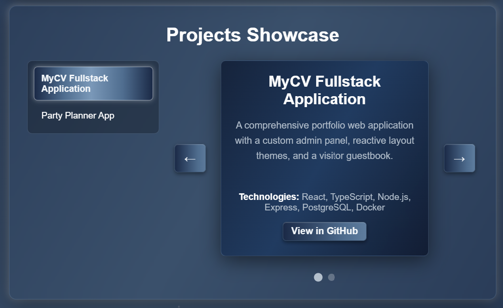
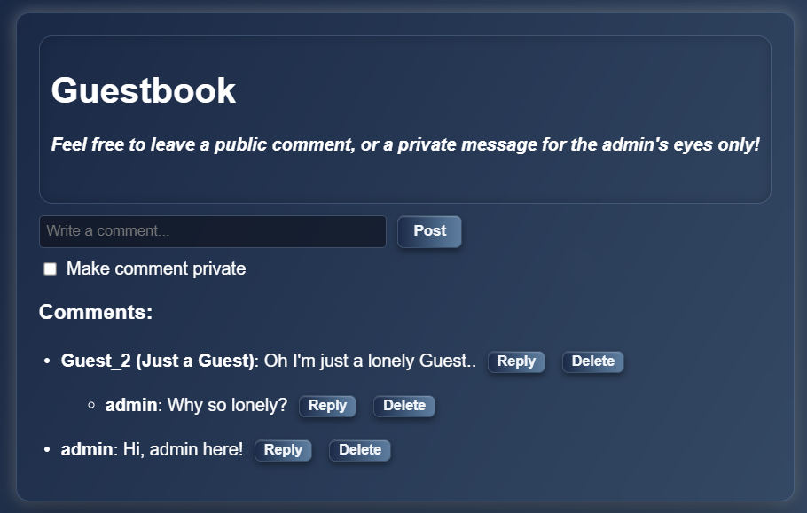
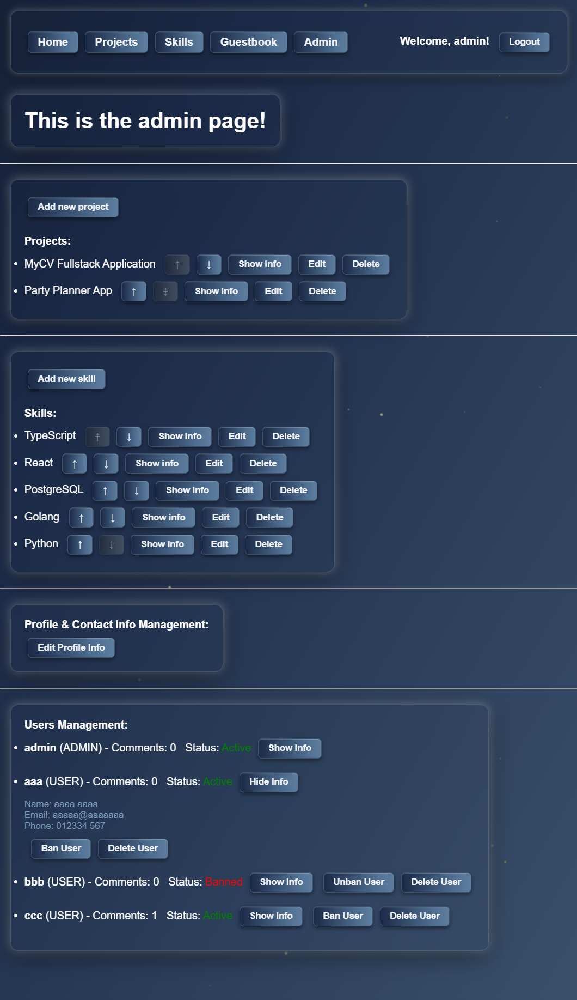

# MyCV Fullstack Application

Live Application: [MyCV App](https://mycv-app-jd17.onrender.com/)

## Description

MyCV is a full-stack personal portfolio and showcase web application built with React, Node.js, Express, PostgreSQL, and Docker. For the regular user, it features a view of dynamic showcases for software development projects and technical skills, a guestbook with public/private comment threads, and reactive layout themes for the signed in users. For the admin, it features an admin panel for content and user management.

## Usage Instructions

- **Projects & Skills Showcase:** Browse through interactive cards showcasing past software engineering projects and technical skills with navigation sliders and quick sidebar lists.
- **Guestbook:** Post comments publicly or send private messages intended for the admin. Supports both registered user accounts and guest comments with custom suffix IDs.
- **User Accounts & Themes:** Users can register and log in to unlock custom UI visual themes (**Golden** and **Rainbow**) and leave messages with additional information for the admin (eg. full name, email, phone number).
- **Admin Panel:** Admin can create, edit, reorder, and delete projects and skills, edit profile information, moderate comments, delete users, and disable commenting privileges for specific users.

## Technologies Used

#### Frontend

- React & TypeScript (Vite)
- React Router
- Axios
- Custom CSS & HTML5 Canvas

#### Backend

- Node.js & Express (TypeScript)
- PostgreSQL & Sequelize ORM
- JWT & bcrypt

#### Testing & DevOps

- Vitest & React Testing Library
- Jest & Supertest
- Playwright (E2E)
- GitHub Actions (CI/CD)
- Render & Aiven.io
- Docker

## Application Features

### Projects & Technical Skills Showcase

- **Animated Carousel Cards:** Interactive showcase sliders with paginated controls for cycling through projects and skills.
- **Detailed Metadata:** Displays project descriptions, technology tags, and direct GitHub source code links.

### Interactive Guestbook & Communication

- **Nested Replies:** Threaded discussion structure allowing visitors to reply directly to specific comments.
- **Public & Private Messaging:** Option to post public comments or send confidential messages visible only to administrators.
- **Guest & Authenticated Posting:** Unauthenticated visitors can leave comments using auto-generated guest identities, while registered users post under their account handles.

### User Account System & Visual Themes

- **Authentication Workflow:** Secure user registration, password verification, and JWT session handling.
- **Dynamic Layout Themes:** Registered users can switch between custom color modes (**Night Sky**, **Golden**, and **Rainbow**).
- **Canvas Particle Overlay:** Animated background canvas effect with floating sparkle particles.

### Administrator Controls & Moderation

- **Content Management:** Full CRUD interface for adding, editing, deleting, and reordering projects and skills.
- **User Management:** Displays user engagement statistics and allows admins to restrict commenting privileges for specific accounts.
- **Comment Moderation:** Administrative tools for deleting inappropriate guestbook entries.

## Evaluator Credentials

For course evaluation and testing of administrative features:

- **Admin Username:** `admin`
- **Admin Password:** _(Included in the submission email and backend environment configuration)_

## Time Tracking

The full worklog and detailed hours breakdown can be found here: [Worklog](documentation/worklog.md)

**Total hours spent:** 217 hours

## Generative AI Usage

For this project, Google Gemini was used as a learning and planning assistant, code reviewer, and debugging partner during development. No files in this repository were mostly or fully generated by AI. All application code, test suites, and features were crafted, reviewed, and tested by hand to ensure a deep understanding of the entire application.

## Local Development & Setup

Follow these steps to run the application locally on your machine.

### Prerequisites

- **Node.js**
- **Docker Desktop** (for local PostgreSQL database)

### Quick Start

1. Clone the repository
2. Navigate into the cloned repository directory
3. Run a command `npm run install:all`
4. Ensure Docker Desktop is running, then run `docker compose up -d`
5. Create a .env file in the `backend` directory based on `.env.example` file
6. Run `npm run dev` to start the application
7. Go to site `http://localhost:5173` where the app is running
